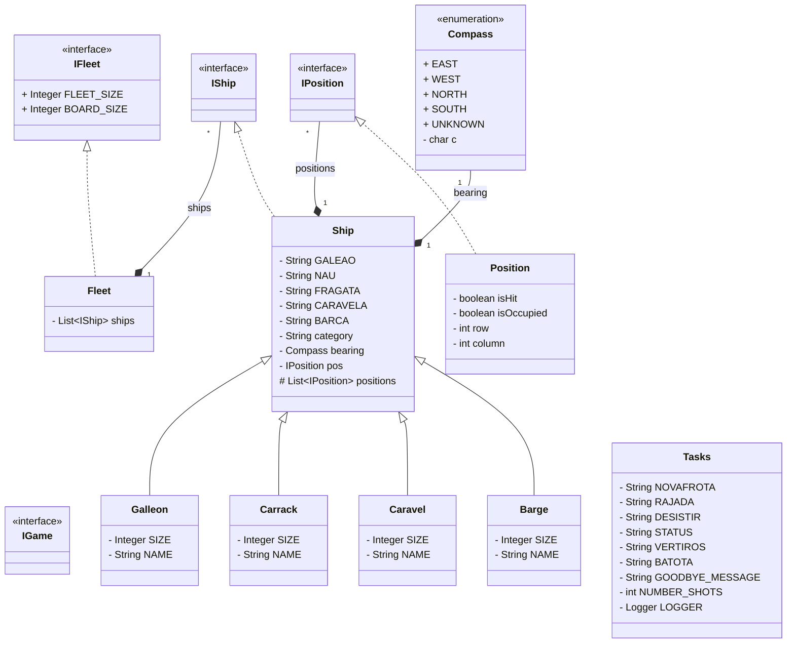

# Arquitetura do Jogo Batalha Naval

O diagrama de classes apresenta a arquitetura e os componentes do modelo de dados para uma implementação do jogo da Batalha Naval (adaptado ao contexto dos Descobrimentos com caravelas, naus e galeões). A estrutura está organizada em interfaces principais — como IGame, IFleet, IShip e IPosition — que definem os contratos fundamentais do sistema, permitindo o desacoplamento e a modularidade do código.

A gestão do tabuleiro e do posicionamento baseia-se na classe Position (que implementa IPosition), responsável por guardar as coordenadas, se uma célula está ocupada e se já foi atingida. As embarcações concretas (Barge, Caravel, Carrack e Galleon) herdam de uma classe base Ship (que implementa IShip), a qual agrega um conjunto de posições ocupadas no mapa e uma orientação geográfica definida pela enumeração Compass (NORTH, SOUTH, EAST, WEST).

Por sua vez, a frota do jogador é representada pela classe Fleet (que implementa IFleet), responsável por agrupar e gerir uma coleção de instâncias de IShip. O sistema conta ainda com a classe Tasks, que funciona como centralizadora de comandos, mensagens de estado e regras de interação (como rajadas de tiros, desistências ou comandos de controlo de jogo).

Este projeto foi desenvolvido com o auxílio de modelos de linguagem baseados em Inteligência Artificial. GitHub Copilot, Gemini e ChatGPT foram utilizados como ferramentas de suporte para programação, depuração de erros e documentação.

Abaixo encontra-se o diagrama de classes do projeto:

