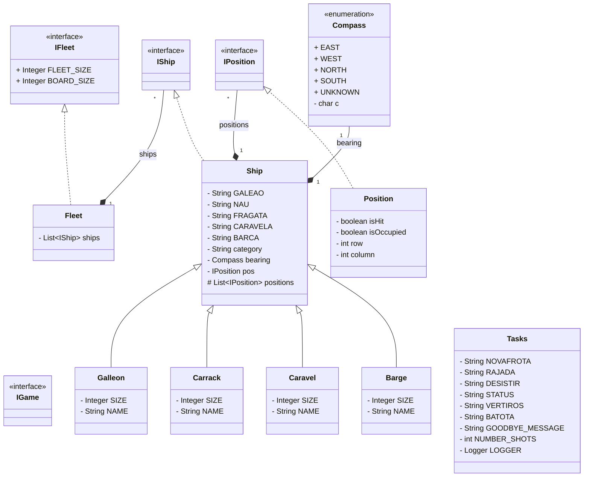

# Arquitetura do Jogo Batalha Naval

Abaixo encontra-se o diagrama de classes do projeto:

```mermaid
classDiagram
  direction BT

  class IFleet {
    <<interface>>
    + Integer FLEET_SIZE
    + Integer BOARD_SIZE
  }
  class IGame {
    <<interface>>
  }
  class IPosition {
    <<interface>>
  }
  class IShip {
    <<interface>>
  }

  class Compass {
    <<enumeration>>
    + EAST
    + WEST
    + NORTH
    + SOUTH
    + UNKNOWN
    - char c
  }

  class Fleet {
    - List~IShip~ ships
  }
  class Position {
    - boolean isHit
    - boolean isOccupied
    - int row
    - int column
  }
  class Ship {
    - String GALEAO
    - String NAU
    - String FRAGATA
    - String CARAVELA
    - String BARCA
    - String category
    - Compass bearing
    - IPosition pos
    # List~IPosition~ positions
  }

  class Barge {
    - Integer SIZE
    - String NAME
  }
  class Caravel {
    - Integer SIZE
    - String NAME
  }
  class Carrack {
    - Integer SIZE
    - String NAME
  }
  class Galleon {
    - Integer SIZE
    - String NAME
  }

  class Tasks {
    - String NOVAFROTA
    - String RAJADA
    - String DESISTIR
    - String STATUS
    - String VERTIROS
    - String BATOTA
    - String GOODBYE_MESSAGE
    - int NUMBER_SHOTS
    - Logger LOGGER
  }

  %% Implementações de Interfaces
  Fleet ..|> IFleet 
  Position ..|> IPosition 
  Ship ..|> IShip 

  %% Heranças
  Barge --|> Ship 
  Caravel --|> Ship 
  Carrack --|> Ship 
  Galleon --|> Ship 

  %% Composições
  Fleet "1" *-- "*" IShip : ships
  Ship "1" *-- "1" Compass : bearing
  Ship "1" *-- "*" IPosition : positions
```
